# **Milestone 2 – Visit Norrtälje**

## **Tourist Bureau**

---

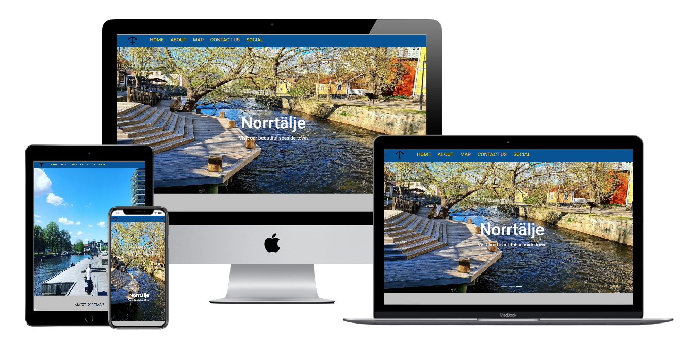
This webpage has been created to showcase the skills I have learned in the interactive frontend section of the Code Institute Full Stack Web Developer course; this is the second of four projects that I will be creating for the course.
For this project I have chosen to create a tourist bureau web page advertising the coastal town of Norrtälje in Sweden.
The reason for this selection is that Norrtälje is the town that I live in and it will allow me to show my abilities to create a web page for a commercial entity using HTML, CSS and UX design techniques, and introduce interactive elements using JavaScript.

---

### **_Table of contents:_**

1. [Description](#tourist-bureau)
2. [UX](#ux)
    1. [The Focus](#the-focus)
    2. [Wireframes](#wireframes)
    3. [Styling](#styling)
    4. [User Stories](#user-stories)
3. [Features](#features)
    1. [Existing Features](#existing-features)
    2. [Features Left to Implement](#features-left-to-implement)
4. [Technology Used](#technology-used)
5. [Testing](#testing)
    1. [Testing User Stories](#testing-user-stories)
    2. [Code Validation](#code-validation)
    3. [Manual Testing](manual-testing)
6. [Deployment](#deployment)
    1. [Remote Deployment](#remote-deployment)
    2. [Local Deployment](#local-deployment)
7. [Credits](#credits)
    1. [Content](#content)
    2. [Media](#media)
    3. [Acknowledgements](#acknowledgements)

---

## **UX**

### **The Focus**

The focus of this website is to showcase Norrtälje, it’s surrounding areas, and the many activities and eateries that it has. The opening Home section aims to impress upon visitors some of the attractive sights in the area with a carousel of images and intrigue potential tourists with a short and informative about section with a little history of the area and highlighting some of the towns best.

Norrtälje is an old town with a large number of restaurants and a newly built modern harbour area, giving an excellent opportunity to use an image carousel for visual stimulation and an interactive map to show where all of the restaurants and activities. The map has ready-made subject buttons, so the website visitor can select an option (i.e. – Restaurants) and have all of the restaurants in the area show up on the map.

The website is simple to navigate and uses a single page style making navigation with a mobile particularly easy. The font and colours have been chosen for their traditional links to Norrtälje and make it clear and attractive to read through the website.

### **Wireframes**
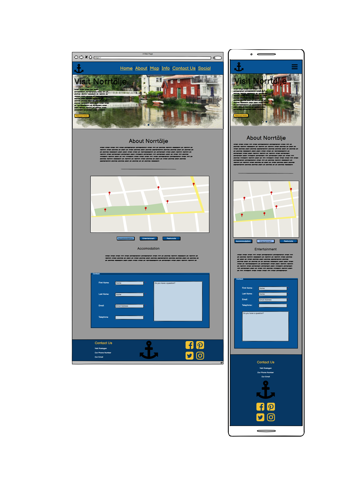

you can find a full size PDF of the Wireframes [here](assets/readme-files/VisitNorrtaljeWireframes.pdf)

#### **Design Differences**

There are some minor differences from the original conception and the final website.
* I decided to remove the find out more button from the home carousel because the link lead to the about section directly underneath the home section and it felt an unnecessary addition.
* For similar reasons I also removed the info section from the main nav. The info only appears after pressing one of the map buttons so it could of been a link to nothing in some cases.
* I moved the Header to the middle of the Home carousel, made it white and removed it from one of the images for ascetical reasons.
* I added an additional "parking" button to the map buttons, parking is an important part of travel and I felt this needed to be added to give a better experience.

### **styling**

#### *Framework*
Bootstrap and jQuery have both been used to form the structural layout of this website.

#### *Fonts*
The Google font Roboto had been used exclusively on the website

#### *Colors*
* There are six non-image colors used on the website:

    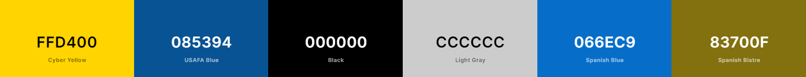
    *   #ffd400 has been used for the Headers on blue backgrounds
    *   #085394 has been used for the Nav, Footer and containers
    *   #000000 has been used for the Main Text
    *   #cccccc has been used for the Main Background
    *   #066ec9 has been used for the blue hover response color
    *   #83700f has been used for the yellow hover response color

### **User Stories**

* **First Time Visitor Goals**

    * *As a First Time Visitor*, I want to be able to navigate the website simply and easily.

    * *As a First Time Visitor*, I want to access the site across all devices.
    * *As a First Time Visitor*, I want to find out about Norrtälje.
    * *As a First Time Visitor*, I want to find where Norrtälje is situated.

* **Returning Visitor Goals**

    * *As a Returning Visitor*, I want to locate the websites social media links to stay up to date with any new content.

    * *As a Returning Visitor*, I would like to be able to search for local attractions
    * *As a Returning Visitor*, I would like to be able to search for restaurants
    * *As a Returning Visitor*, I would like to be able to contact the bureau.

---

## **Features**

* The Project is a one-page website with five main sections and a footer.

    1. The website has a home section that has a full screen width image carousel scrolling through images of Norrtälje and the surrounding area. Over the carousel is Visit Norrtälje header and a ‘More Info’ button that navigates the user to the about.
    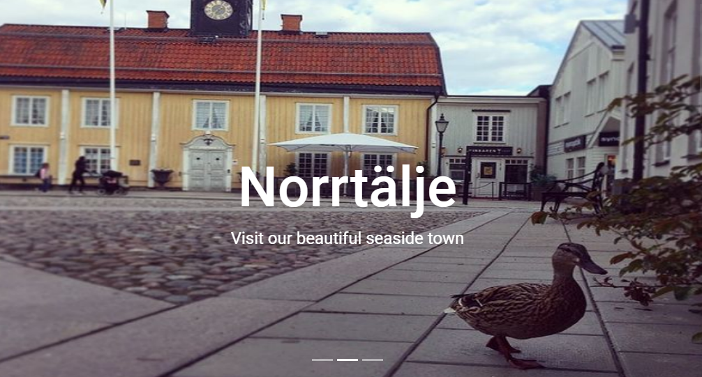    
    
    2. The second section is a short About Us section which advertises some of the history of Norrtälje and the appealing reasons to, it also has a link to the footer where you can access the address and social links.
    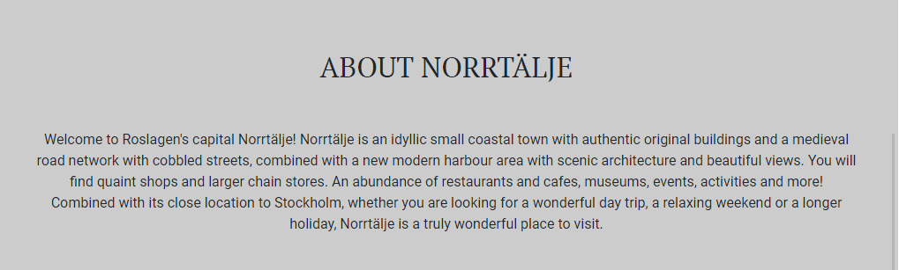
    
    3. The third section is the map section, the map is interactive with buttons that allow the user to locate all of the restaurants, attractions, accommodation, etc within and around Norrtälje.
    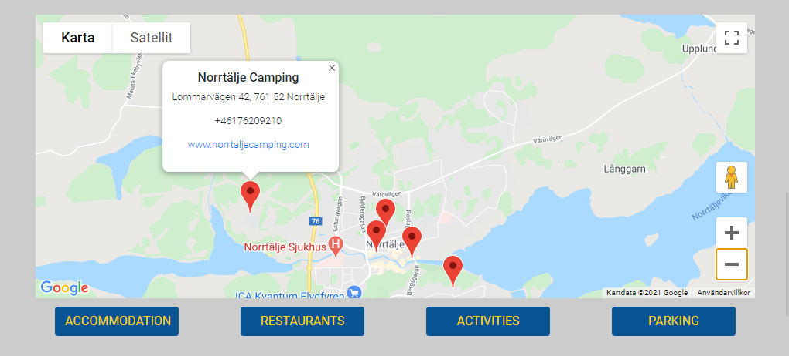
    
    4. The next section is the Info section. The Info section is linked to the map and the info changes depending on which button is pressed. It supplies the customer with short additional information about each of the subjects.
    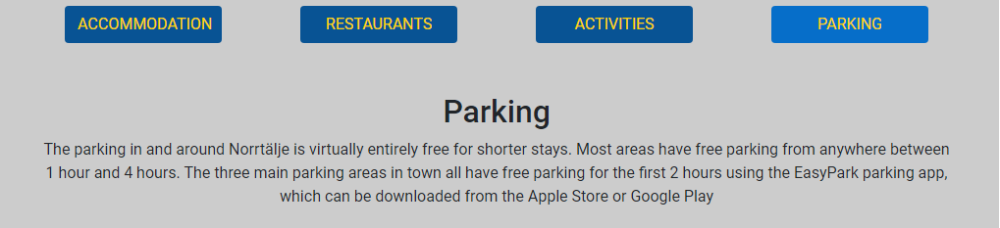
    
    5. The last main section is the Contact form. The form allows the customer to make contact with the bureau directly via email.
    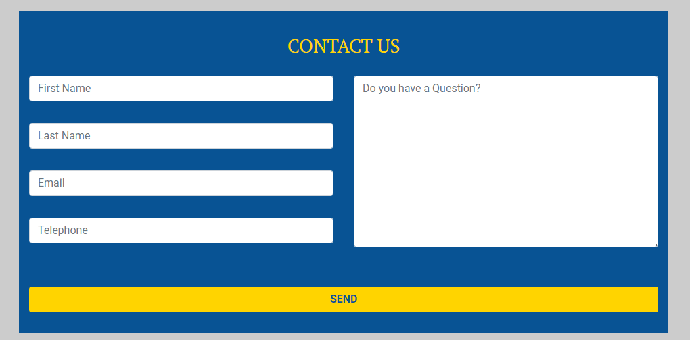
    
    6. At the bottom is a footer. The footer has three columns. The first column holds the address, the middle column displays Norrtälje’s coat of arms and The last column has social media linking icons.
    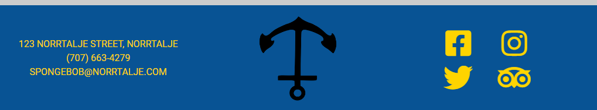

### **Existing Features**

*	The site has been designed to be responsive across all devices

*	The page has a permanent sticky navbar which navigates to the top of each section of the page.
*	The navbar is styled differently for different screen sizes, changing from a three line “hamburger” dropdown nav on mobile to a traditional full screen navbar on larger screens
*	The map section has multiple interactive buttons that produce pins on the map locating the particular subject the visitor is searching for
*	The info section is also connected to the map buttons, the content changes depending on subject of the button
*	The Contact section is a functioning contact form which sends an email to the bureau
*	The footer displays the address, the Norrtälje coat of arms and social media links
*	On smaller devices the footer becomes a single vertical column

### **Features Left to Implement**

* A 'Bookings' feature that allows the visitor to book accommodation directly from the website

* A multi-functional bookings interface that would allow the user to book activities or tables at restaurants in the area
* A you are here section on the map which gives directions from where the user is to a particular destination
* An area for selling Visit Norrtälje apparel and souvenirs 

---

## **Technologies Used**

All of the following technologies were used to create this website:-

*	Both **HTML5** and **CSS3** have been used throughout the project to create the text and style of the website

*	**JavaScript** and [Jquery]( https://jquery.com/) were used to implement the carousel function on the image carousel section and to simplify DOM manipulation
*	[GoogleFonts](https://fonts.google.com/) has been used to style the font of the text throughout the website
*	[FontAwesome](https://fontawesome.com/) was used to add icons to the exercise class headers
*	[Bootstrap]( https://getbootstrap.com/) was used for layout aesthetics, including grid styling and device responsiveness
*	[Gimp]( https://www.gimp.org/) was used to size the images
*	[GitHub]( https://github.com/) was used to host the website
*	[Gitpod]( https://www.gitpod.io/) was used to code the website
*	[Balsamiq]( https://balsamiq.com/) was used to create the wireframes of the project
*   [FireShot](https://getfireshot.com/) was used to create the screenshots for the README
*   [Techsini](https://techsini.com/multi-mockup/) was used to style the multi screen mockup
*   [Coolors](https://coolors.co/) was used to create the color palette screenshot
*   [User-Agent Switcher](https://chrome.google.com/webstore/detail/user-agent-switcher-for-c/djflhoibgkdhkhhcedjiklpkjnoahfmg) was used for testing functionality on different browsers

---

## **Testing**

### **Testing User Stories from the UX Section**

**First Time Visitor Goals**

* *As a First Time Visitor*, I would like to know what the company does upon opening the site.
    *   On opening the website the visitor is met with the main image carousel with an advertisement proclaiming they should visit Norrtälje

* *As a First Time Visitor*, I want to be able to navigate the website simply and easily.
    *	The website has a sticky navigation menu that is always available to allow quick access to each section of the site.
    *	Each section is clearly marked with a header

* *As a First Time Visitor*, I want to access the site across all devices.
    *	The website is responsive across all devices
    *	The website has three different layouts depending on what size screen the customer is using

* *As a First Time Visitor*, I want to find out about Norrtälje.
    *	The about section has some information on the town and the navbar has a button that directs the user to the about section
    *   The info section also has additional information about certain subjects such as restaurants and activities

* *As a First Time Visitor*, I want to find where Norrtälje is situated.
    *   The about section explains where Norrtälje is located
    *   The interactive map shows Norrtälje’s exact position in Sweden.

**Returning Visitor Goals**

* *As a Returning Visitor*, I want to locate the websites social media links to stay up to date with any new content.
    *   The social media links are found on the footer at the bottom of the page

* *As a Returning Visitor*, I would like to be able to search for accommodation in the area
    *	The interactive map has an accommodation button, allowing the visitor to see all of the available accommodation

* *As a Returning Visitor*, I would like to be able to search for restaurants and activities in the area
    *	The interactive map has both a restaurant button and an activities button.
    *   Additionally there are several other buttons including a parking button so visitors can decide where best to park.

* *As a Returning Visitor*, I would like to be able to contact the bureau.
    *   The website has a contact form that can be used to contact the bureau directly by email
    *   The navbar has a contact button that direct the visitor to the contact form
    *   The address and contact details of the bureau are also located in the footer

### **Code Validation**

#### *W3 Validators*

*    The HTML was Validted at [W3C Markup Validation Service](https://validator.w3.org/). 

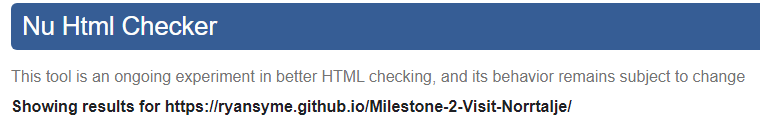
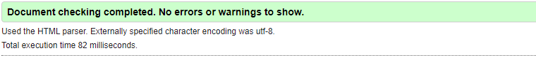

*    The CSS was validate at [W3C CSS Validation Service](http://jigsaw.w3.org/css-validator/).

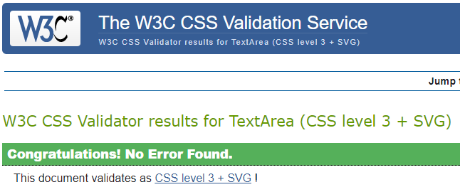

*    The Javascript was validated at [JSHint](https://jshint.com/).

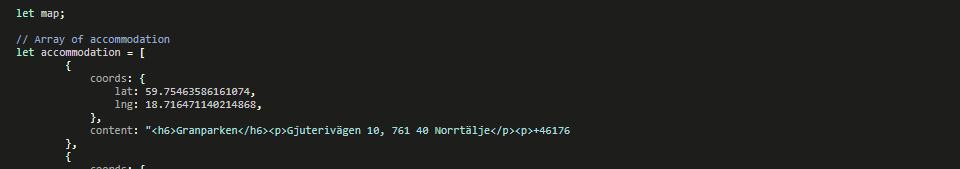

### **Manual Testing**

#### *Google Developer Tools*

   *    The websites design responsiveness has been tested on all device sizes using Google Developer Tools.

#### *Testing On Mobile Devices*
   *    Apple iOS
   *    Google Android 7
   *    Microsoft Windows Phone
   *    Samsung Tizen OS
   *    Nokia Symbian
   *    Mozilla Firefox OS
 
#### *Testing On Browsers*
   *    Google Chrome
   *    Opera
   *    Firefox
   *    Apple Safari
   *    Microsoft Explorer
   *    Microsoft Edge
    
#### *Testing On Operating Systems*
   *    Microsoft Windows
   *    Linux
   *    Apple Mac OS
   *    Google Chrome OS
   *    IBM Warp

    
#### *Issues Found*

*   An issue was found with the carousel on mobile devices, the resizing would make the text too large and distort the carousel.
    *   The issue was resolved with some changes to text sizes in the media queries

*   JSHint found a missing semi-colon in my JavaScript.
    *   The issue was fixed by adding the semi-colon

*   I was unable to make EmailJS function using the way I had been taught by Code Institute.
    *   The issue was fixed by using a newer piece of code from the [EmailJS](https://www.emailjs.com/docs/tutorial/creating-contact-form/) website.

---

## **Deployment**

### **Remote Deployment**
1. Navigate to the GitHub [Repository:](https://github.com/RyanSyme/Milestone-2-Visit-Norrtalje)
2. Click the **Settings** Tab.
3. Scroll Down to the **Git Hub Pages** Heading.
4. Select **Master Branch** as the source.
5. Click the **Save button**.
6. Click on the link to go to the live deployed page.

### **Local Deployment**
1. Navigate to the GitHub [Repository:](https://github.com/RyanSyme/Milestone-2-Visit-Norrtalje)
2. Click the **Code** drop down menu.
3. Download the ZIP file and unpack locally
4. Open a code editor of your choice and open the unzipped file using the code editor.
5. Click **Save** and save to your local device

---

## **Credits**

### **Content**
*	Code was used from [Developers.Google](https://developers.google.com/maps/documentation/javascript/tutorials)

*   With additional help from [Traversy Media](https://www.youtube.com/watch?v=Zxf1mnP5zcw&t=1101s)

### **Media**

* The photos used in this site were obtained from [Norrtälje Kommun]( https://www.instagram.com/norrtaljekommun/?hl=en/) 

*   The coat of arms image used to as a logo for the site was obtained from 
    [SearchPNG.com]( https://www.searchpng.com/)

### **Acknowledgements**

*	I received design inspiration from:

    * **Matt Rudge** at [Code Institute](https://courses.codeinstitute.net/login) 
    
    * [Developers.Google](https://developers.google.com/maps/documentation/javascript/tutorials) 
    * [Traversy Media](https://www.youtube.com/channel/UC29ju8bIPH5as8OGnQzwJyA) 
    * [geeksforgeeks.org](https://www.geeksforgeeks.org/how-to-clear-form-after-submit-in-javascript-without-using-reset/)

*	I received styling inspiration from:

    *   [CSS-Tricks.com](https://css-tricks.com) 
    
*   Additional Thanks to my mentor **Oluwafemi Medale** for styling and formatting advice
